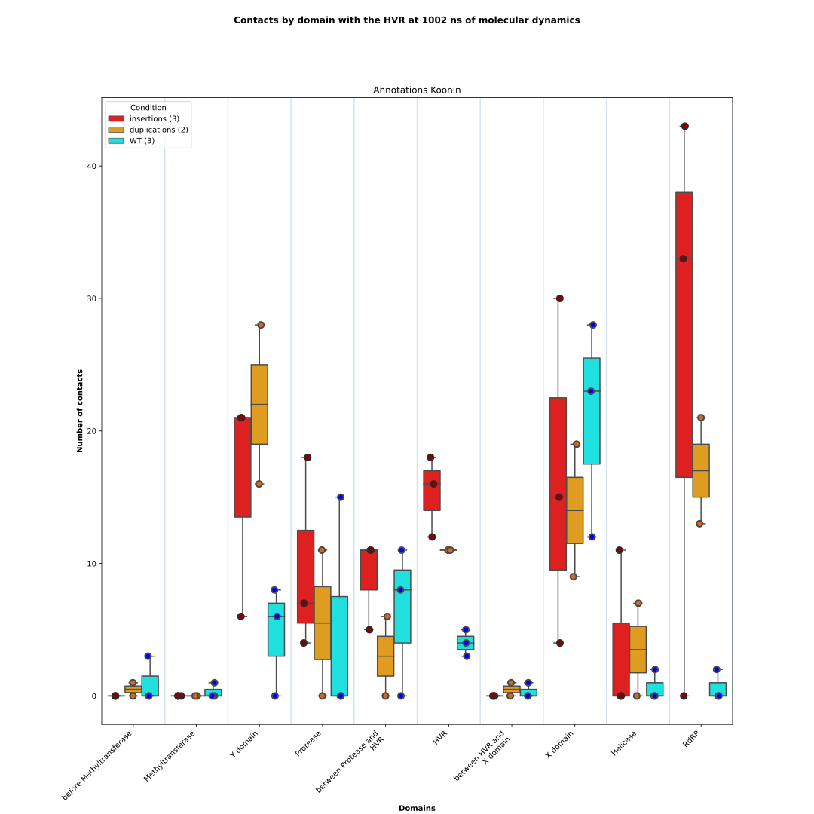

# Aggregate the contacts

From the CSV files describing the amino acids contacts between a Region of Interest and the other regions of a protein 
during a Molecular Dynamics simulation, the script will produce a plot of the boxplots representing those contacts by 
domains and conditions.

The input CSV data are produced by the [plot_contacts](https://github.com/njeanne/plot_contacts/tree/main) script.

## Conda environment

A [conda](https://docs.conda.io/projects/conda/en/latest/index.html) YAML environment file is provided: 
`conda_env/python3_env.yml`. The file contains all the dependencies to run the script.
The conda environment is generated using the command:
```shell script
# create the environment
conda env create -f conda_env/python3_env.yml

# activate the environment
conda activate python3
```

## Usage

The script can be tested with the test data provided in the `data` directory, which contains a CSV file describing the 
different conditions and the location of the directory containing the CSV output files from the [plot_contacts.py](https://github.com/njeanne/plot_contacts) 
script.

An optional argument `--domain` can be used, which is the path to a CSV file describing the domains of a protein. 
The order of the domains will be used to order the boxplots in the plot.

The commands to use the script are:

```shell script
conda activate python3

./contacts_aggregate.py --md-time 1002 --domain data/sample_domains.csv \
--subtitle "Annotations Koonin" --out results data/conditions.csv

conda deactivate
```

## Outputs

The script outputs are:
- boxplots of the contacts by conditions and domains. Student statistical tests (t-tests) are performed for each domain between each pair of conditions.
Only the significant p-values are annotated:
```shell
p-value annotation legend:
      ns: 5.00e-02 < p <= 1.00e+00
       *: 1.00e-02 < p <= 5.00e-02
      **: 1.00e-03 < p <= 1.00e-02
     ***: 1.00e-04 < p <= 1.00e-03
    ****: p <= 1.00e-04
```



- a CSV file of the contacts by condition and domain.
