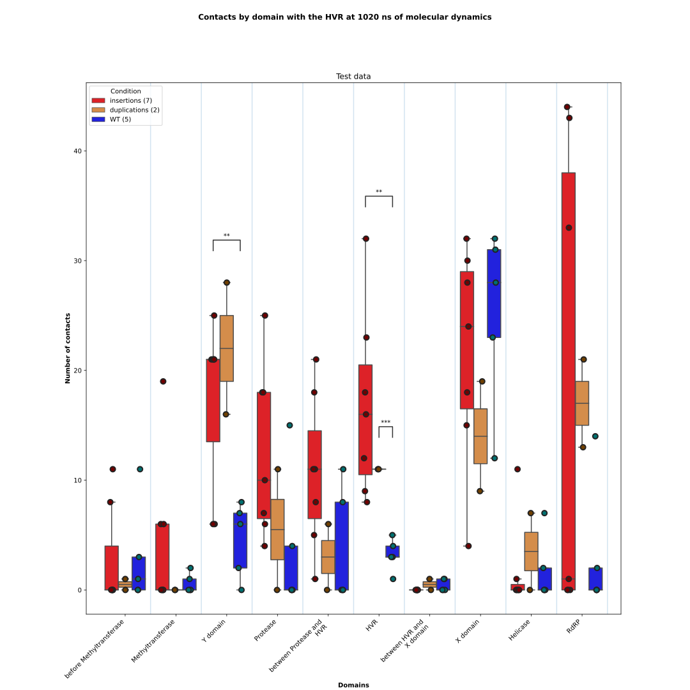
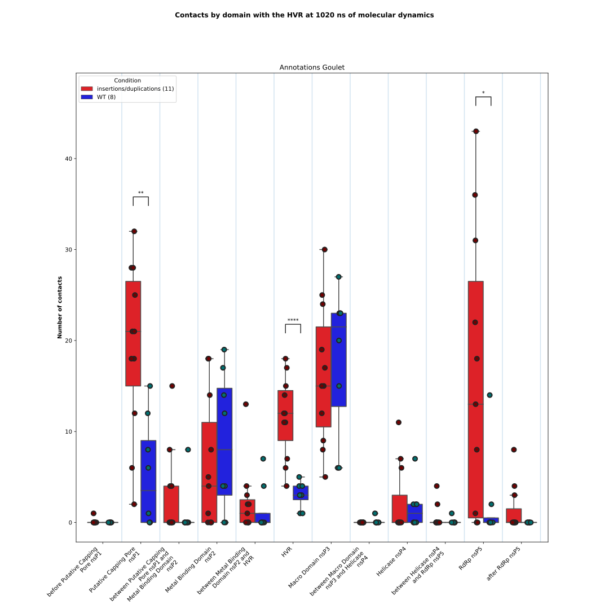

# Aggregate the contacts

From the CSV files describing the amino acids contacts between a Region of Interest and the other regions of a protein 
during a Molecular Dynamics simulation, the script will produce a plot of the boxplots representing those contacts by 
domains and conditions and a statistical test file.

The input CSV data are produced by the [plot_contacts](https://github.com/njeanne/plot_contacts/tree/main) script.

## Conda environment

A [conda](https://docs.conda.io/projects/conda/en/latest/index.html) YAML environment file is provided: 
`conda_env/contacts_aggregate_env.yml`. The file contains all the dependencies to run the script.
The conda environment is generated using the command:
```shell script
# create the environment
conda env create -f conda_env/contacts_aggregate_env.yml

# activate the environment
conda activate contacts_aggregate
```

## Usage

The script can be tested with the test data provided in the `data` directory, which contains a CSV file describing the 
different conditions and the location of the directory containing the CSV output files from the [plot_contacts.py](https://github.com/njeanne/plot_contacts) 
script.

The input CSV file must be a comma separated file with a header as in the following example:

| condition    | path | boxplot color | dot color |
|--------------|---|---|---|
| insertions   | data/plot_contacts_outputs/insertions | #fc030b | #700101 |
| duplications | data/plot_contacts_outputs/duplications | #eb8c34 | #704001 |
| WT           | data/plot_contacts_outputs/WT | #0303fc | #017070 |

Some optional arguments can be used:
- `--domain`: which is the path to a CSV file describing the domains of a protein. The order of the domains will be used to order the boxplots in the plot.
- `--group`: to group some conditions of the input CSV file.

The command to use the 3 conditions of the input CSV file is:
```shell script
conda activate contacts_aggregate

./contacts_aggregate.py --md-time 1002 --domain data/sample_domains.csv \
--subtitle "Annotations Koonin" --out results data/conditions.csv

conda deactivate
```

The command to group *insertions* and *duplications* is:
```shell script
conda activate contacts_aggregate

./contacts_aggregate.py --group insertions duplications --md-time 1002 --domain data/sample_domains.csv \
--subtitle "Annotations Koonin" --out results data/conditions.csv

conda deactivate
```

## Outputs

The script outputs are:
- boxplots of the contacts by conditions and domains. Mann-Whitney tests with **two-sided as the null hypothesis** are performed for each domain between each pair of conditions.
Only the significant p-values are annotated:
```shell
p-value annotation legend:
      ns: 5.00e-02 < p <= 1.00e+00
       *: 1.00e-02 < p <= 5.00e-02
      **: 1.00e-03 < p <= 1.00e-02
     ***: 1.00e-04 < p <= 1.00e-03
    ****: p <= 1.00e-04
```

For the command using the 3 conditions separately:


For the command grouping *insertions* and *duplications*:


- a CSV file of the Mann-Whitney test results with **group 1 greater than group 2 as the null hypothesis**, i.e. with the conditions *insertions* and *duplications* grouped:

|contact with            |group 1                |group 2|p-value              |statistic|test          |H0                                        |comment|
|------------------------|-----------------------|-------|---------------------|---------|--------------|------------------------------------------|-------|
|before Methyltransferase|insertions/duplications|WT     |0.812822861623181    |17.0     |Mann-Whitney U|insertions/duplications is greater than WT|       |
|Methyltransferase       |insertions/duplications|WT     |0.4381654618297056   |24.0     |Mann-Whitney U|insertions/duplications is greater than WT|       |
|Y domain                |insertions/duplications|WT     |0.010657315395681436 |40.0     |Mann-Whitney U|insertions/duplications is greater than WT|       |
|Protease                |insertions/duplications|WT     |0.03948850647883433  |36.0     |Mann-Whitney U|insertions/duplications is greater than WT|       |
|between Protease and HVR|insertions/duplications|WT     |0.08757024472318475  |33.0     |Mann-Whitney U|insertions/duplications is greater than WT|       |
|HVR                     |insertions/duplications|WT     |0.0016421125928250471|45.0     |Mann-Whitney U|insertions/duplications is greater than WT|       |
|between HVR and X domain|insertions/duplications|WT     |0.9048843208833199   |16.0     |Mann-Whitney U|insertions/duplications is greater than WT|       |
|X domain                |insertions/duplications|WT     |0.8574693887342786   |15.0     |Mann-Whitney U|insertions/duplications is greater than WT|       |
|Helicase                |insertions/duplications|WT     |0.5922874483459629   |21.5     |Mann-Whitney U|insertions/duplications is greater than WT|       |
|RdRP                    |insertions/duplications|WT     |0.11907753607849125  |31.5     |Mann-Whitney U|insertions/duplications is greater than WT|       |

  
- a CSV file listing the contacts by condition and domain:

|sample         |conditions             |domains                 |contacts|
|---------------|-----------------------|------------------------|--------|
|HEPAC-100_PEPB1|insertions/duplications|between Protease and HVR|18      |
|HEPAC-100_PEPB1|insertions/duplications|Protease                |10      |
|HEPAC-100_PEPB1|insertions/duplications|Methyltransferase       |6       |
|HEPAC-100_PEPB1|insertions/duplications|HVR                     |32      |
|...            |...                    |...                     |...     |
|MF444031-3c_WT |WT                     |between HVR and X domain|0       |
|MF444031-3c_WT |WT                     |Protease                |0       |
|MF444031-3c_WT |WT                     |Methyltransferase       |0       |
|MF444031-3c_WT |WT                     |Helicase                |0       |

## Vigilance on outputs

The statistical results may vary between the boxplots significance p-values and the CSV p-values
because the null hypothesis is different:

- boxplots H0: the two populations are different.
- CSV statistics file: the contacts' count the group 1 distribution is greater than the one of the group 2. 